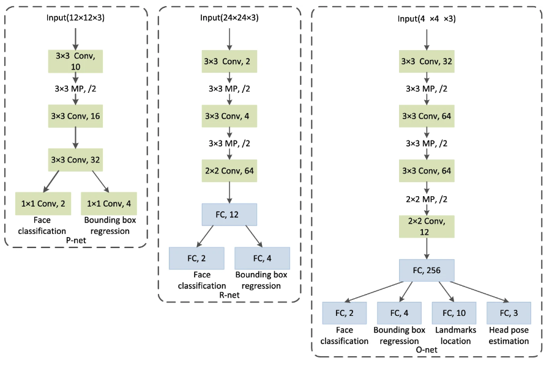

# Artificial Intelligence Module
Our group decided to use Artificial Intelligence inside the Web Application to create a more streamlined login experience for the user by recoginize their face.

## How the system work?
The task of face recognition can be divided into two part: Face detection and face recognition Both part utilize neural network to efficiently do its job.

### Face detection:
Our system uses MTCNN (Multi-Task Cascaded Convolutional Neural Networks) which has a structure of:

MTCNN consists of 3 neural networks, or 3 stages:
- Stages 1 - **P-net**: It produces candidate windows by shallow fully convolutional network

- Stages 2 - **R-net**: It rejects as many non-face windows as possible. The structure of the network in this stage is deeper

- Stages 3 - **O-net**: This stage use even more complex network to further refine the output of the R

MTCNN produces bouding box for each face in a image, which can be used to extract each face for the next step.

### Face recogntion:
Our system uses a network based on Inception-ResNet-V1 architecture implemented in PyTorch. This network input is 160x160 px images comming from MTCNN and produces a 512-D vector for each image represent 512 features of each person's face.

To differentiate between users, our system uses Eculidean distance between each person's face vector. A face belong to a person if the distance between that face feature vector and the person feature vector is less than some value. In our experiment, the value of 0.8 seems like a good fit.

## Our implementation

To start doing face recognition, first we have to have a face database of each person in our system. We collected 5 photos of each team member's face to extract each person's face feature in form of one 512-dimensional vector. These images should be taken with different lighting condition as well as from different angle.

We feed our images into the system to obtain each person's embedding, which is a median vector from 5 feature vectors from our input image. These vectors are then stored inside a file for faster loading and uses.

The backend of our web-app can communicate with the AI services using HTTPS protocol and send in user's face for verification. After recieving request from the web application server, the AI service will try to recognize the image and return the result to the web application in JSON format. The speed of recognizing each image is fast, only about 500ms, including round trip time.